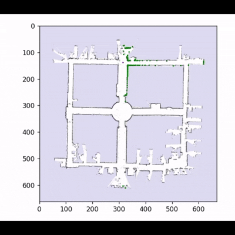

# Correlative Scan Matching

### A python implementation of the Paper [A 2D-LiDAR-based localization method for indoor mobile robots using correlative scan matching ~ Song Du, Tao Chen, Zhonghui Lou and Yijie Wu](https://www.cambridge.org/core/journals/robotica/article/2dlidarbased-localization-method-for-indoor-mobile-robots-using-correlative-scan-matching/291583763D866B1739AEF58ADC34D659#disp2)

The [Aces Relations Dataset](http://ais.informatik.uni-freiburg.de/slamevaluation/datasets.php) available at SLAM was used in order to see the results

* Implemented Correlative Scan Matching in order to correct odometry data based on lidar scans
* Implemented the Low Pass Filter mentioned in the paper by computing covariance matrix between corrected and predicted poses
* Used vectorized operations in order to improve performance of the algorithm
* Implemented the Likelihood Fields Model as mentioned in the paper
* Implemented a triggerable global localization module for pose correction (Not in use due to large computational requirement)

### Results

|   Before   |   After   |
|:----------:|:---------:|
|||